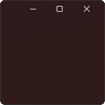

<h1 align="center">MicaWPF</h1><br />
<div align="center"> 

    </div>
<div align="center">
<h4>This is a library to make Mica available in WPF because we can't wait for WinUI 3.0 to support it in unpackaged apps.</h4>
    
[](https://www.nuget.org/packages/MicaWPF/latest)
[](https://www.nuget.org/packages/MicaWPF/latest/prerelease)
[](https://www.nuget.org/packages/MicaWPF/)
[](https://github.com/Simnico99/MicaWPF/blob/main/LICENSE)
</div>

<h2 align="center">Overview</h2>

### Installation
Download via the Nuget package manager.
```nuget
Install-Package MicaWPF
```

### Preview
<br/><br/>
Also snap grid works with this method:<br/>


### Usage

First in the code behind your window add those lines:
```csharp
    public partial class MainWindow : Window
    {
        public MainWindow()
        {
            InitializeComponent();
            Loaded += MainWindow_Loaded; //<-- Add this line
        }

        private void MainWindow_Loaded(object sender, RoutedEventArgs e) //< --Add this entire method or add to your loaded method.
        {
            this.UpdateStyleAttributes(); 
        }
    }
```

In the window xaml add this:
```xaml
<Window x:Class="WpfDemo.MainWindow"
        xmlns="http://schemas.microsoft.com/winfx/2006/xaml/presentation"
        xmlns:x="http://schemas.microsoft.com/winfx/2006/xaml"
        xmlns:d="http://schemas.microsoft.com/expression/blend/2008"
        xmlns:mc="http://schemas.openxmlformats.org/markup-compatibility/2006"
        xmlns:local="clr-namespace:WpfDemo"
        mc:Ignorable="d"
        Title="MainWindow" 
        Height="450" 
        Width="800"        
        Background="Transparent"> <!-- It's important to make it transparent -->
    <WindowChrome.WindowChrome> <!-- You can customise this section so it works well with your kind of app. -->
        <WindowChrome 
            CaptionHeight="20"
            ResizeBorderThickness="8"
            CornerRadius="0"
            GlassFrameThickness="-1"
            UseAeroCaptionButtons="True" />
    </WindowChrome.WindowChrome>
    <Grid>

    </Grid>
</Window>

```

### More Info
There is a demo app you can download in the demo folder if you need a template or to see it in action.
